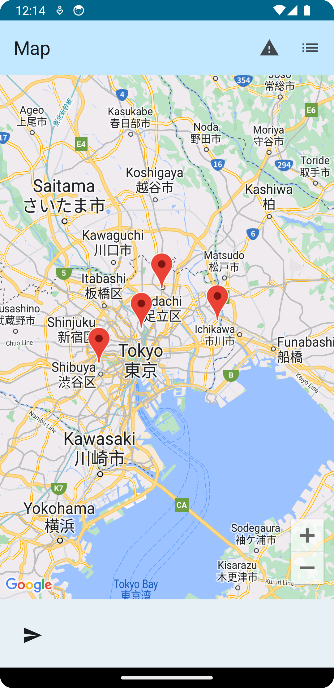

# Jetpack Compose を使用したサンプルアプリ

## 環境

```
Android Studio Hedgehog | 2023.1.1 Patch 2
Build #AI-231.9392.1.2311.11330709, built on January 19, 2024
Runtime version: 17.0.7+0-17.0.7b1000.6-10550314 aarch64
VM: OpenJDK 64-Bit Server VM by JetBrains s.r.o.
macOS 13.6.3
GC: G1 Young Generation, G1 Old Generation
Memory: 2048M
Cores: 8
Metal Rendering is ON
Registry:
external.system.auto.import.disabled=true
debugger.new.tool.window.layout=true
ide.text.editor.with.preview.show.floating.toolbar=false
ide.experimental.ui=true
```

## 機能

- マップをクリックするとマーカーをさせる
- マーカーを指した場所を一覧として見れる
- データの永続化は未実装

- Map 画面
  - 
- List 画面
  - 

## 勉強リンク

- Kotlin
  - https://blog.y-yuki.net/entry/2019/05/22/090000
  - [Kotlin によるプログラミングの概要](https://developer.android.com/courses/pathways/android-basics-compose-unit-1-pathway-1?hl=ja)
- Android App (with Jetpack Compose)
  - https://developer.android.com/jetpack/compose/tooling/previews?hl=ja
  - https://developer.android.com/courses/android-basics-compose/course?hl=ja
    - ここから UI 構築、状態管理、ページ遷移に絞って勉強
    - Kotlin については

## Google Map 実装参考

- https://developers.google.com/maps/documentation/android-sdk/maps-compose?hl=ja
- https://github.com/googlemaps/android-maps-compose
